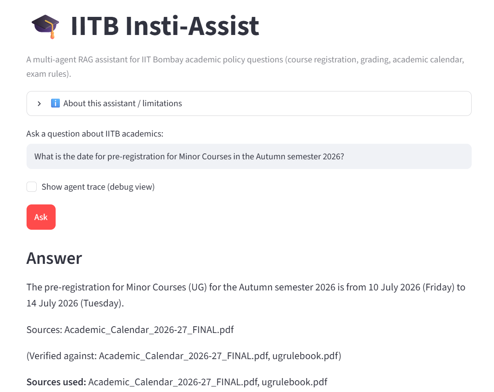

# 🎓 IITB Insti-Assist - Academic Assistant

[](https://github.com/kcodweb/IITB-Insti-Assist/actions/workflows/tests.yml)
[](LICENSE)

## Demo



A multi-agent, RAG-grounded assistant for IIT Bombay academic-policy questions
(course registration, grading, academic calendar, exam rules, branch change).
Every answer cites the exact document page it came from, is fact-checked by a
separate critic agent before you see it, and the assistant says "I don't know"
instead of guessing when the documents don't cover a question.

Built for a combined NLP capstone: it satisfies both a **"RAG assistant"**
brief and a **"multi-agent system"** brief at once, by implementing the RAG
pipeline *as* a small team of coordinated agents instead of one monolithic
retrieve-then-generate script.

> ℹ️ **Documents included**: `data/raw/` ships with two real IIT Bombay
> source documents, the **UG Rules & Regulations** (`ugrulebook.pdf`) and the
> **Academic Calendar 2026-27** (`Academic_Calendar_2026-27_FINAL.pdf`). See
> "Adding your documents" below if you want to add more.

**Highlights**

- 💬 Chat UI with follow-up questions ("what about Spring?"), live agent trace, and page-level sources
- 🔎 Hybrid retrieval (semantic + keyword): **100% Hit@4** on a 52-question labelled eval set, up from 88% in v1
- 🛡️ Two-layer hallucination guard: rule-based citation/number checks + an LLM critic
- 🧪 Offline test suite (scripted LLM, no API key needed) and a reproducible retrieval benchmark

---

## 1. Architecture — Supervisor pattern

```
                        ┌────────────┐
           ┌───────────▶│ supervisor │◀─────────────┐
           │            └─────┬──────┘               │
           │      RETRIEVE │ ANSWER │ CRITIQUE │ FINISH
           │                 ▼        ▼         ▼      │
           │          ┌──────────┐┌─────────┐┌────────┐│
           │          │retrieval ││ answer  ││ critic ││
           │          │  agent   ││  agent  ││ agent  ││
           │          └────┬─────┘└────┬────┘└───┬────┘│
           └───────────────┴───────────┴─────────┘
                                                    │
                                                    ▼
                                                ┌────────┐
                                                │ finish │
                                                └────────┘
```

Four distinct agents, one orchestration pattern (**Supervisor**):

| Agent | File | Responsibility |
|---|---|---|
| **Supervisor** | `src/agents/supervisor.py` | Owns all control flow. Looks at the shared state and decides which worker runs next. Never touches documents or drafts text itself. Deterministic Python, so it's cheap and unit-tested. |
| **Retrieval Agent** | `src/agents/retrieval_agent.py` | The *only* agent that talks to the vector store. Rewrites follow-up questions into standalone queries using the conversation, runs hybrid search, and decides whether anything relevant enough was found (`grounded: bool`). |
| **Answer Agent** | `src/agents/answer_agent.py` | Drafts an answer using **only** the retrieved passages, citing each claim inline (`[1]`, `[2]`). If the critic rejected a previous draft, it revises that draft using the feedback. |
| **Critic Agent** | `src/agents/critic_agent.py` | The hallucination guardrail. First a **rule check**: a citation to a passage that doesn't exist is rejected outright, and any number in the draft that appears nowhere in the sources is flagged. Then an independent, skeptical **LLM review** of the draft against the numbered passages. |

All four communicate through one shared state object (`src/state.py`) —
a "blackboard" architecture — rather than passing messages directly to each
other. Every worker node routes back to the supervisor when it's done; the
supervisor is the only node allowed to decide what happens next. This is
what makes it a genuine Supervisor pattern rather than a fixed pipeline: the
same "ANSWER" node can be revisited multiple times depending on the critic's
verdict, capped at `MAX_REVISIONS` (default 2) so it can't loop forever.

Each answer ends in one of three states, shown as a badge in the UI:
**verified** (critic approved), **unverified** (revision budget ran out; the
answer is shown with the critic's remaining concern), or **refused** (nothing
relevant in the documents).

### Why RAG needed to be multi-agent here (not just "one agent with extra steps")
A single retrieve-then-generate call has no way to catch its own
hallucinations — if the LLM states something not in the retrieved context,
nothing stops it. Splitting "write the answer" and "check the answer" into
two independent agents with different prompts and different jobs is what
lets the system enforce "don't hallucinate, say I don't know instead" as an
actual architectural guarantee (a second, skeptical pass) rather than just a
hopeful instruction to a single call.

---

## 2. RAG pipeline details

**Ingestion** (`src/rag/ingest.py`)
- Text is extracted per page with `pdfplumber`, then cleaned: running
  footers (the rulebook's "Move to Index"), bare page numbers and words
  hyphenated across lines are removed, and table-of-contents pages are
  skipped (they mention every topic but answer nothing, so they used to
  crowd real answers out of the results).
- **Section-aware chunks.** The ingester follows each document's heading
  structure (`6 EXAMINATION / ASSESSMENT > 6.5 Grading`,
  `(B) SCHEDULE FOR SPRING SEMESTER`) and prefixes every chunk with a
  `[document | section]` header. This matters most for the calendar: the
  Autumn and Spring tables use identical wording, so without the header a
  chunk from page 7 gave no hint which semester its dates belong to.
- **Chunking**: `RecursiveCharacterTextSplitter`, 800-char chunks / 150-char
  overlap, never crossing a page boundary so citations point to the exact page.
- **Embeddings**: `BAAI/bge-small-en-v1.5` (local, free, no API key).
- **Vector store**: ChromaDB with cosine distance, persisted to
  `data/chroma_db/`. Chunks get deterministic IDs and the index keeps a
  manifest (a hash of the documents plus the chunking/embedding settings), so
  it **rebuilds itself automatically** whenever a document or setting changes
  — and rebuilding never duplicates chunks.

**Retrieval** (`src/rag/retriever.py`)
- **Hybrid search**: dense (bge) and keyword (BM25) rankings merged with
  Reciprocal Rank Fusion. Keywords rescue acronym-heavy questions ("DX",
  "FF", "URA02", "IDDDP") that small embedding models blur.
- **Groundedness gate**: the question counts as answerable only if the best
  dense match has cosine similarity ≥ `0.55`. Otherwise `grounded=False` and
  the system refuses without calling the LLM. The value was tuned on the eval
  set below.

---

## 3. Evaluation

`eval/questions.jsonl` is a hand-labelled set of **68 questions**: 52
answerable ones (36 rulebook, 16 calendar, each labelled with the page(s)
that answer it), 8 clearly out-of-scope ones, and 8 that *sound* in-scope but
aren't covered (hostel mess timings, tuition fees, …). Run it with:

```bash
python -m eval.run_eval
```

Retrieval results (top-4 chunks, same questions for every row):

| Configuration | Hit@1 | Hit@4 | MRR |
|---|---|---|---|
| **v1** — MiniLM, raw pages, 500/100 chunks, dense only | 77% | 88% | 0.817 |
| MiniLM + cleaning & section headers, 800/150 | 75% | 92% | 0.822 |
| … + hybrid BM25 | 83% | 96% | 0.891 |
| bge-small, 800/150, dense only | 81% | 94% | 0.864 |
| **v2** — bge-small, 800/150, hybrid | **87%** | **100%** | **0.926** |

The script also sweeps `RELEVANCE_THRESHOLD`. At the default `0.55`, 100% of
answerable questions pass the gate and 7 of 8 out-of-scope questions are
refused before any LLM call. Anything that slips through still has to get
past the answer agent ("the documents don't cover this") and the critic.
Questions that sound in-scope but aren't covered can't be filtered by
similarity alone; the answer and critic agents handle those.

`python -m eval.run_eval --e2e` runs the full agent graph on every question
and checks each answer for the expected fact. It needs an LLM API key.

> Caveat: the set is small and was written against these two documents, and
> the configuration was chosen on it, so treat the numbers as indicative. Add
> questions to `eval/questions.jsonl` as you find failure cases.

---

## 4. Setup

```bash
git clone https://github.com/kcodweb/IITB-Insti-Assist.git
cd IITB-Insti-Assist
python -m venv .venv
source .venv/bin/activate          # Windows: .venv\Scripts\activate
pip install -r requirements.txt

cp .env.example .env               # Windows: copy .env.example .env
# edit .env and set GOOGLE_API_KEY (get one at https://aistudio.google.com/app/apikey)
```

The first run downloads the embedding model (~130MB) and builds the Chroma
index automatically (about a minute on a laptop CPU). It needs internet
access once.

### Adding your documents

`data/raw/` already includes two real source documents:
- `ugrulebook.pdf` — IIT Bombay Rules & Regulations for Undergraduate Programmes
- `Academic_Calendar_2026-27_FINAL.pdf` — Academic Calendar 2026-27

To add more, drop additional PDFs (or `.txt` files) into `data/raw/`.
Optionally give each one a friendly title in `data/sources.json`. The title
appears in chunk headers, citations and the sidebar:

```json
{
  "grading_circular.pdf": {
    "title": "Grading Circular 2026",
    "description": "Changes to the grading policy announced in July 2026"
  }
}
```

That's it: the next run notices the change and rebuilds the index. You can
also rebuild explicitly with `python -m src.rag.ingest`.

If a PDF is a **scanned image** (no selectable text), `pdfplumber` can't
extract anything from it and you'll see a warning. Run it through OCR first
(e.g. `ocrmypdf input.pdf output.pdf`) and use the OCR'd version.

---

## 5. Running it

**Web UI**
```bash
streamlit run app.py
```

**CLI**
```bash
python main.py "What is the minimum attendance to avoid a DX grade?"
```

Run `python main.py` with no question for an interactive chat with follow-ups.
Add `--no-trace` to hide the agent trace.

**Tests** (no API key or model download needed; the LLM and vector search are faked)
```bash
pip install -r requirements-dev.txt
pytest
```

---

## 6. Example trace

```
Q: When are the Spring 2027 end-semester exams?

--- Agent trace ---
[supervisor] -> routing to RETRIEVE
[retrieval_agent] found 5 relevant chunk(s) (grounded=True)
[supervisor] -> routing to ANSWER
[answer_agent] wrote initial draft
[supervisor] -> routing to CRITIQUE
[critic_agent] verdict: APPROVED (LLM review)
[supervisor] -> routing to FINISH
[finish] draft approved by critic — returning final answer
```

The answer follows, with its inline citations resolved to sources, e.g.
`[1] Academic Calendar 2026-27, page 7 — (B) SCHEDULE FOR SPRING SEMESTER`.

A follow-up such as "and for Autumn?" first gets rewritten by the retrieval
agent (`rewrote follow-up as: "When are the Autumn 2026 end-semester exams?"`).
An out-of-scope question ("What's the capital of France?") stops at
`grounded=False` and gets a polite refusal without any LLM call.

---

## 7. Configuration

All settings live in `src/config.py` and can be overridden in `.env`:

| Variable | Default | What it does |
|---|---|---|
| `LLM_PROVIDER` | `gemini` | `gemini`, `anthropic` or `openai` (install `langchain-anthropic` / `langchain-openai` for the latter two) |
| `GEMINI_MODEL` | `gemini-2.5-flash` | Model used by all three LLM-backed agents |
| `EMBEDDING_MODEL` | `BAAI/bge-small-en-v1.5` | Any sentence-transformers model |
| `CHUNK_SIZE` / `CHUNK_OVERLAP` | `800` / `150` | Characters per chunk / overlap |
| `TOP_K` | `5` | Passages handed to the answer agent |
| `RELEVANCE_THRESHOLD` | `0.55` | Minimum best-match cosine similarity to attempt an answer |
| `HYBRID_SEARCH` | `true` | Blend BM25 keyword search into retrieval |
| `MAX_REVISIONS` | `2` | Critic-requested rewrites before giving up (also a slider in the UI) |
| `HISTORY_WINDOW` | `6` | Previous chat messages the agents see for follow-ups |

Changing any indexing setting triggers an automatic index rebuild.

---

## 8. Project structure

```
IITB-Insti-Assist/
├── app.py                     # Streamlit chat UI
├── main.py                    # CLI (one-shot or interactive)
├── requirements.txt           # + requirements-dev.txt for tests
├── .env.example
├── .streamlit/config.toml     # disables Streamlit's noisy file watcher
├── .github/workflows/tests.yml  # CI: runs pytest on every push / PR
├── LICENSE                    # MIT (code only)
├── data/
│   ├── raw/                   # source PDFs (UG Rulebook, Academic Calendar 2026-27)
│   ├── sources.json           # optional friendly titles for each document
│   └── chroma_db/             # built automatically, gitignored
├── eval/
│   ├── questions.jsonl        # labelled eval set
│   └── run_eval.py            # retrieval metrics, threshold sweep, --e2e
├── src/
│   ├── config.py              # all tunables (env-overridable)
│   ├── state.py               # shared AgentState (the "blackboard")
│   ├── graph.py               # LangGraph wiring (Supervisor pattern), run() / stream()
│   ├── agents/
│   │   ├── supervisor.py
│   │   ├── retrieval_agent.py
│   │   ├── answer_agent.py
│   │   ├── critic_agent.py
│   │   └── finish_agent.py
│   ├── rag/
│   │   ├── ingest.py          # clean, section-aware chunking, embed, persist (+ manifest)
│   │   └── retriever.py       # hybrid search + groundedness gate
│   └── utils/
│       ├── llm.py             # provider-agnostic chat model factory
│       └── grounding.py       # context formatting, citation parsing, number checks
└── tests/                     # pytest: routing, critic parsing, ingestion, index rebuilds
```

## 9. Troubleshooting

**A wall of `ModuleNotFoundError: No module named 'torchvision'` when running Streamlit.**
It's harmless. Streamlit's file watcher inspects every submodule
`transformers` could import. The bundled `.streamlit/config.toml` turns the
watcher off, which silences it and speeds up reruns. If you want hot-reload
while editing code, run `streamlit run app.py --server.fileWatcherType auto`
and ignore the noise.

**`FileNotFoundError: No .txt or .pdf documents found in data/raw`**
You haven't added any source documents yet. See "Adding your documents" above.

**The answer is always "I don't know", even for something you know is in a PDF.**
Check that `pdfplumber` could extract text from that PDF (rerun
`python -m src.rag.ingest` and watch for a "no extractable text found"
warning). A scanned PDF needs OCR first. If the text is there, the question
may be scoring just under `RELEVANCE_THRESHOLD`. Add it to
`eval/questions.jsonl` and use `python -m eval.run_eval` to choose a new
value.

---

## Author

**Karan Bansal**  
Roll No.: **24B3003**

## License

The code is released under the [MIT License](LICENSE). The PDFs in
`data/raw/` are official IIT Bombay documents, included for reference only;
they are not covered by the MIT License.
